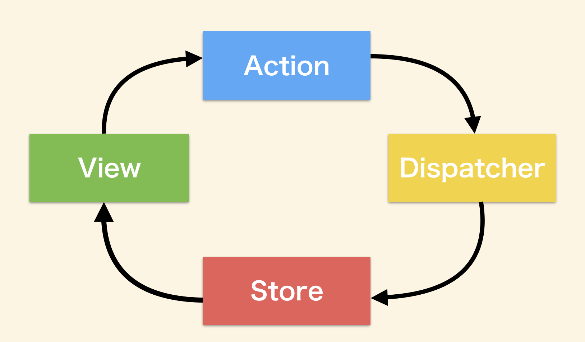
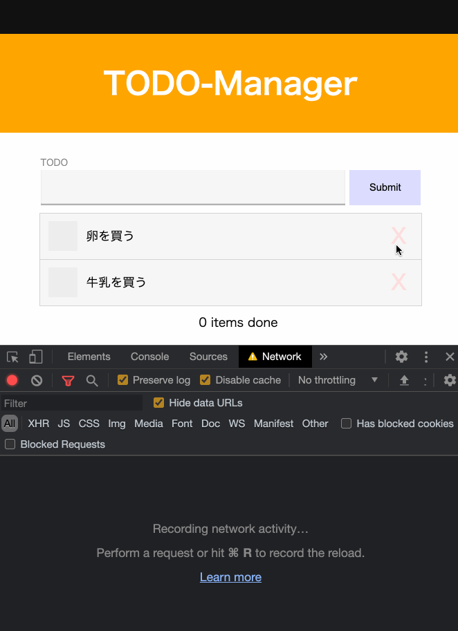

# 開発環境 構築 (1回実行すればよいです)

```bash
$ cd server && npm i
```

# 開発環境の起動

```bash
# terminal 1
$ cd client && bash run.bash

# terminal 2
$ cd server && npm run start
```

# 開発途中のTODO管理アプリを完成せよ

あなたは，TODO管理アプリ 開発チームに参画しました．
しかし，前任の開発者はすでにいません．
残されたのは，開発途中のアプリとドキュメント，残タスクリストです．
残されたドキュメントと作成途中のコードを読み解き，TODO管理アプリを完成させよう．

## 残されたドキュメント 1. アーキテクチャ



- Flux アーキテクチャで実装している
- Action は次のような js の object 形式で表現している

```typescript
{
  type: string
  payload: any /* 文字列でも，object でも何でも入れて良い */
          | undefined /* payload が不要なときは undefined とする*/
}
```

- payload は any または undefined とする
- 上記のような object を作成する 関数を action creater と命名している
- action creator は create prefix で命名している
- アプリケーション起動時に一覧取得するための Action を dispatch している

## 残されたドキュメント 2. 未着手タスク一覧

### TODO を作成できるようにする


- [ ] `js/components/todo-form.js` を編集して，作成ボタンに `.addEventListener` を使ってイベントハンドラを登録する，ログには適当に `clicked` などを出力しよう, todo 名は `.todo-form__input` タグに入力される，作成ボタンは `.todo-form__submit` に入力される
  - hint: `Element: click イベント`
  - hint: `EventTarget.addEventLlistener`
- [ ] TODO を作成するという action creator を `js/flux/index.js` に実装しよう `createFetchTodoListAction` が参考になるだろう，このとき payload に todo 名を入れるようにしよう
- [ ] ActionCreator を作成したら  `js/components/todo-form.js` で Action を作成して `store.dispatch()` を使って dispatch しよう，そのとき devtool のログに Action が dispatch されているかどうかを確認しよう
- [ ]  `js/flux/index.js` の `reducer` 関数に，TODO 作成アクションが通知されたケースの処理を実装しよう，サーバーに接続する前にクライアント上の store が 保持している `{ todoList: [] }` を更新しよう
  - hint: `Array.prototype.push`
- `fetch()` を使って実際にAPIを叩いてサーバー上のデータを更新しよう
  - hint: `Fetch API`

#### MEMO

- コマンドラインから todo を作成する場合は以下のコマンドを実行

```bash
$ curl -X POST http://localhost:3000/todo -H 'Content-Type: application/json' -d '{"name": "卵を買う", "done": false}'
```

- このコマンドを実行してから リロード (`http://localhost:1234`) すると，一覧に todo が表示されるだろう
- 開発用サーバーは プロセスを落とすと，データが揮発する

### TODO を更新できるようにする



- [ ] `js/components/todo.js` を編集して，check ボタンに適当なイベントハンドラを登録しよう
- [ ] TODO を 更新するという action creator を実装しよう
- [ ] check ボタンが押されたら該当の action を dispatch しよう
- [ ] reducer 関数に action 発生時の処理を追加しよう
- [ ] API と接続しよう

### TODO を削除できるようにする


- [ ] `js/components/todo.js` を編集して，削除 ボタンに適当なイベントハンドラを登録しよう
- [ ] TODO を 更新するという action creator を実装しよう
- [ ] check ボタンが押されたら該当の action を dispatch しよう
- [ ] reducer 関数に action 発生時の処理を追加しよう
- [ ] API と接続しよう

## 残されたドキュメント 3. API サーバー仕様

開発用 API サーバーは 3000 番 ポートで起動する

### Todo model

- id: number
> id は uniq
- name: string
- done: boolean
> todo が 完了したかどうかのステータス, true だと完了

### GET `/todo` todo 一覧取得 API

#### Example

- request body : なし

- response body

```json
{
  "todoList": [
    {
      "id": 1,
      "name": "牛乳を買う",
      "done": false
    },
    {
      "id": 2,
      "name": "部屋を掃除する",
      "done": true
    }
  ]
}
```

### POST `/todo` todo 新規作成 API

#### Example

- request body

```json
{
  "name": "卵を買う"
}
```

- response body

status: 201

```json
{
  "id": 3,
  "name": "卵を買う",
  "done": false
}
```

### PATCH `/todo/:id` todo 更新 API

> MEMO:
> done を true / false に更新するのに活用する
> 余裕があれば todo名 変更機能もこのAPIを活用して実装する

#### Example

- request body

endopoint : `/todo/3`

```json
{
  "name": "卵を買う",
  "done": true
}
```

- response body

status: 201

```json
{
  "id": 3,
  "name": "卵を買う",
  "done": true
}
```

### DELETE `/todo/:id` todo 削除 API

> MEMO:
> このAPIを叩いたあと，一覧を再取得しないと
> フロントエンド側のTODO一覧が更新されない

#### Example

- request body : なし

- response body : なし (204)

